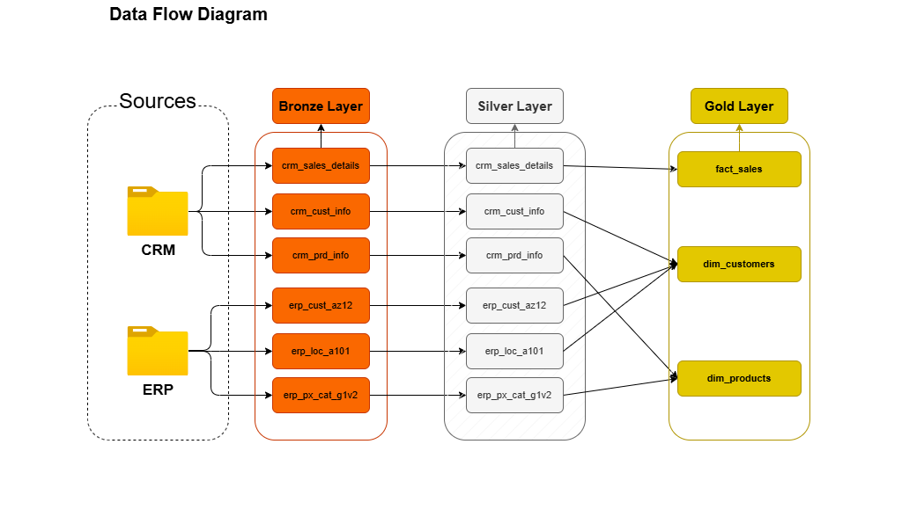
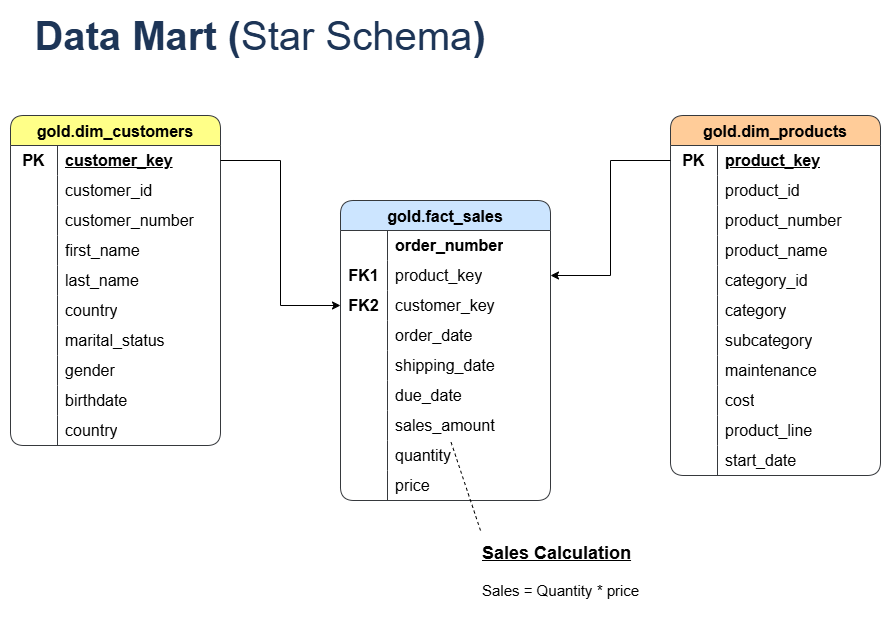
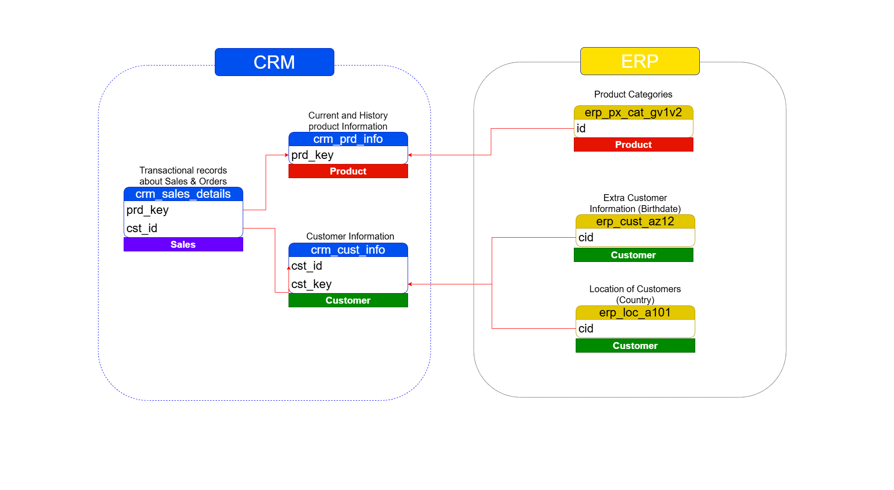

# 🏢 Data Warehouse and Analytics Project (SQL-Based)

Welcome to the **Data Warehouse and Analytics Project** repository! 🚀  
This project demonstrates a complete end-to-end **Data Warehousing** and **Analytics** solution, designed and implemented entirely using **SQL**.  
It showcases the process of transforming raw source data into valuable business insights following modern data engineering best practices.

---

## 📘 Project Overview

This project covers all key stages of data warehousing:

1. **Data Architecture** – Designing a layered data warehouse structure using the **Medallion Architecture (Bronze, Silver, Gold)** approach.  
2. **Data Flow** – Mapping the data movement and transformation steps from source systems to analytical layers.  
3. **Data Modeling** – Designing **Star Schema** models with fact and dimension tables optimized for analytical queries.  
4. **Integration Model** – Combining multiple data sources into a unified, consistent model ready for reporting and analysis.

🎯 Ideal for showcasing skills in:
- SQL Development  
- Data Engineering  
- Data Modeling  
- ETL Design  
- Data Analytics  
- Data Architecture  

---

## 🧱 Data Architecture

The project follows the **Medallion Architecture**, consisting of three layers:

(docs/Data_Architecture.png)

- **Bronze Layer**: Ingests raw data directly from CSV source systems (ERP & CRM) into SQL tables.  
- **Silver Layer**: Cleansed, standardized, and validated datasets ready for transformation.  
- **Gold Layer**: Business-ready, analytical model built for reporting and insights.

---

## 🔄 Data Flow Diagram

The following diagram illustrates how data moves through each stage of the ETL process — from ingestion to transformation and reporting:

[](docs/Data_Flow_Diagram.png)

Key steps include:
1. Extracting data from CSV files into staging tables.  
2. Applying transformations (joins, aggregations, deduplication).  
3. Loading processed data into analytical fact and dimension tables.

---

## 🧩 Data Model

The **Star Schema** model was designed for efficient analytical queries and reporting. It includes one or more fact tables connected to multiple dimension tables.

[](docs/Data_Model.png)

- **Fact Tables**: Contain measurable business metrics such as sales, revenue, or transactions.  
- **Dimension Tables**: Provide descriptive attributes like customer, product, or region.

---

## 🔗 Integration Model

The **Integration Model** demonstrates how data from multiple source systems (e.g., ERP, CRM) is harmonized into a unified warehouse model.

[](docs/Integration_Model.png)

This ensures consistent data definitions and supports cross-domain analytics across various data sources.

---

## ⚙️ Technical Implementation

### Database:  
- **SQL Server** (but can be adapted for PostgreSQL, MySQL, or any relational database)

### Key Tasks:
- Build ETL pipelines purely in SQL (no external ETL tools)  
- Design schema following best normalization and denormalization practices  
- Create stored procedures for automated data refresh and transformation  
- Write analytical SQL queries for KPI generation  

---

## 🧮 Analytical Insights

SQL queries were designed to generate insights such as:
- **Top-performing products**
- **Customer retention and churn**
- **Regional sales trends**
- **Monthly and yearly sales performance**

These outputs serve as a foundation for dashboards and BI reporting (e.g., Power BI, Tableau).

---

## 📂 Repository Structure
```
data-warehouse-project/
│
├── datasets/                           # Raw datasets used for the project (ERP and CRM data)
│
├── docs/                               # Project documentation and architecture details
│   ├── etl.drawio                      # Draw.io file shows all different techniquies and methods of ETL
│   ├── data_architecture.drawio        # Draw.io file shows the project's architecture
│   ├── data_catalog.md                 # Catalog of datasets, including field descriptions and metadata
│   ├── data_flow.drawio                # Draw.io file for the data flow diagram
│   ├── data_models.drawio              # Draw.io file for data models (star schema)
│
├── scripts/                            # SQL scripts for ETL and transformations
│   ├── bronze/                         # Scripts for extracting and loading raw data
│   ├── silver/                         # Scripts for cleaning and transforming data
│   ├── gold/                           # Scripts for creating analytical models
│
├── tests/                              # Test scripts and quality files
│
├── README.md                           # Project overview and instructions
├── LICENSE                             # License information for the repository
```
---

## 🏁 Conclusion

This project highlights the power of SQL in building scalable, analytical data warehouse systems — from raw ingestion to business-ready insights.  
It’s an excellent demonstration of practical skills in **data modeling**, **data integration**, and **analytical SQL development**.

---

### 👨‍💻 Author  
**Tejassingh Kharayat**  
📧 [tejas.kharayat27@gmail.com](mailto:tejas.kharayat27@gmail.com)  
🌐 [LinkedIn Profile](https://www.linkedin.com/in/tejas-kharayat-a4701b30b/)

---
